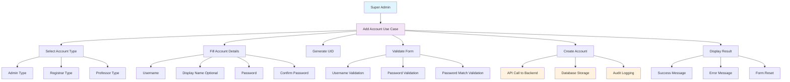

# Admin Add Account Use Case Diagram

## Overview
This document outlines the use case for the Admin Add Account functionality in the West Coast College Admin system.

## Use Case Diagram (Mermaid)

## Primary Actor
**Super Admin** - The authenticated administrator with privileges to create new accounts

## Preconditions
1. Super Admin is logged into the system
2. Authentication token is valid and stored
3. Database connection is available
4. User has necessary permissions to create accounts

## Main Success Flow (Basic Flow)

### 1. Initiate Account Creation
- **Actor**: Super Admin
- **Action**: Navigates to Add Account page
- **System**: Loads AddAccount component
- **System**: Fetches current admin profile
- **System**: Displays current session information

### 2. Select Account Type
- **Actor**: Chooses account type from three options:
  - **Administrator**: Full system access and user management
  - **Registrar**: Handle student records and registration  
  - **Professor**: Academic faculty with teaching privileges
- **System**: Updates selected type in state
- **System**: Triggers UID generation based on account type

### 3. Generate Unique ID (UID)
- **System**: Calls `getAccountCount(accountType)` API
- **System**: Generates UID using format:
  - Professor: `1YYYYXXXHHMM` (starts at 3000)
  - Admin: `1YYYYXXXHHMM` (starts at 6000)
  - Registrar: `1YYYYXXXHHMM` (starts at 9000)
- **System**: Displays generated UID in read-only field

### 4. Fill Account Details
- **Actor**: Enters required information:
  - **Username** (required)
  - **Display Name** (optional, auto-generated if blank)
  - **Password** (required, min 8 characters)
  - **Confirm Password** (required)
- **System**: Updates form state in real-time

### 5. Form Validation
- **System**: Validates all required fields are filled
- **System**: Validates password length (minimum 8 characters)
- **System**: Validates password and confirm password match
- **System**: Displays validation errors if any fail

### 6. Submit Account Creation
- **Actor**: Clicks "Create Account" button
- **System**: Shows loading state
- **System**: Auto-generates display name if blank

### 7. Backend Processing
- **System**: Makes POST request to `/api/admin/accounts`
- **Backend**: Validates authentication token
- **Backend**: Validates input data:
  - Username, password, UID presence
  - Account type validity
  - Password length
- **Backend**: Checks for existing username
- **Backend**: Checks for existing UID
- **Backend**: Creates new Admin record in database
- **Backend**: Logs audit trail for account creation

### 8. Response Handling
- **System**: Receives success response
- **System**: Displays success message
- **System**: Resets form to default state
- **System**: Generates new UID for next account

## Alternative Flows

### 3a. UID Generation Failure
- **System**: Fails to get account count from API
- **System**: Uses fallback count (1)
- **System**: Generates fallback UID
- **Flow**: Continues to step 4

### 5a. Validation Errors
- **System**: Detects validation failure
- **System**: Displays specific error message:
  - "Please fill in all required fields"
  - "Password must be at least 8 characters long"
  - "Passwords do not match"
- **Flow**: Returns to step 4

### 7a. Backend Validation Errors
- **Backend**: Detects validation failure
- **Backend**: Returns error response:
  - "Username, password, and UID are required"
  - "Invalid account type"
  - "Password must be at least 8 characters long"
  - "Username already exists"
  - "UID already exists"
- **System**: Displays error message
- **Flow**: Returns to step 4

### 7b. Database Unavailable
- **Backend**: Detects database connection failure
- **Backend**: Returns 503 status
- **System**: Displays "Database unavailable" error
- **Flow**: Returns to step 4

### 7c. Authentication Failure
- **Backend**: Detects invalid/missing token
- **Backend**: Returns 401 status
- **System**: Redirects to login page
- **Flow**: Use case ends

## Postconditions
- **Success**: New account is created and stored in database
- **Success**: Audit log entry is created
- **Success**: Form is reset for next account creation
- **Failure**: No changes to database
- **Failure**: Appropriate error message is displayed

## Business Rules
1. Only Super Admin can create new accounts
2. Username must be unique across all accounts
3. UID must be unique and follows specific format
4. Password must be at least 8 characters long
5. Account type determines permissions and UID generation
6. All account creations are logged for audit purposes

## Data Requirements

### Input Data
- **username**: string, required, unique
- **displayName**: string, optional
- **accountType**: enum ['admin', 'registrar', 'professor']
- **password**: string, required, min 8 chars
- **uid**: string, auto-generated, unique

### Output Data
- **success**: message, account object (without password)
- **error**: error message string

### Stored Data
- Account record in Admin collection
- Audit log entry
- Current admin session token

## System Integration Points
- **Frontend**: React component (AddAccount.tsx)
- **API**: REST endpoint `/api/admin/accounts`
- **Database**: MongoDB Admin collection
- **Authentication**: JWT token validation
- **Audit**: Audit logging system

## Security Considerations
- All requests require valid authentication token
- Passwords are stored securely in database
- Input validation prevents injection attacks
- Audit trail tracks all account creation activities
- Rate limiting should be implemented on the endpoint
